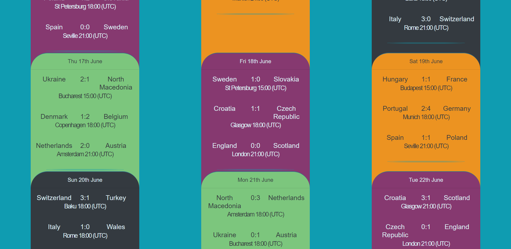

# Euro 2020 (2021) unofficial Webpage of result

### WebApp created with React, Bootstrap, Redux, Json-Server and Testing Library

## Screenshots 

### Mobile 

||
|:--:|
|*Fixtures top*|

||
|:--:|
|*Fixtures*|

||
|:--:|
|*Groups top*|

||
|:--:|
|*Groups*|

### Desktop

||
|:--:|
|*Fixtures top*|

||
|:--:|
|*Fixtures*|

||
|:--:|
|*Groups top*|

||
|:--:|
|*Groups*|

## Project status

This project is currently in development. Visitors can check actual fixtures without cookies or other trackers. There are few bugs to be fix.

> Still required:
>
> - array refresh after reading it's value (Tree Section)
>
> - tests

## Available Scripts

In the project directory, you can run:

### `npm i`

Install packages listed in package.json.
It's required to install packages before starting an app.

### `npm run api`

Start API in the development mode.\
Open [http://localhost:3000](http://localhost:3000) to view it in the browser console.

### `npm start`

Runs the app in the development mode.\
Open [http://localhost:3000](http://localhost:3000) (with API [http://localhost:3001](http://localhost:3001)) to view it in the browser.

The page will reload if you make edits.\
You will also see any lint errors in the console.

### `npm run start-3001`

Runs the app in the development mode.\
Opens app directly on port [http://localhost:3001](http://localhost:3001)

The page will reload if you make edits.\
You will also see any lint errors in the console.

## Authors:

### Jakub Krzywanski and Artur Garlej
